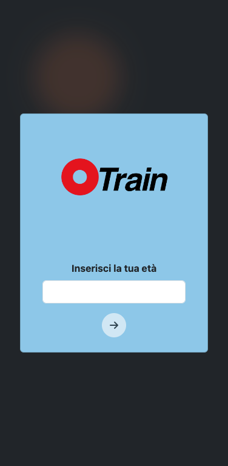
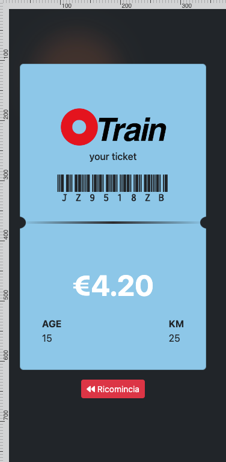

# Boolean Academy - Train Ticket Form

This is a solution to the exercise n. 17 of Boolean Academy. 

## Table of contents

- [Overview](#overview)
  - [The challenge](#the-challenge)
  - [Screenshot](#screenshot)
  - [Links](#links)
- [My process](#my-process)
  - [Built with](#built-with)
- [Author](#author)

## Overview

### The challenge

Users should be able to:

- View the optimal layout for the component depending on their device's screen size
- See hover states for all interactive elements on the page
- Insert two values (one for the age and one for the kilometers)
- See the generated ticket with the price information (discounted if they're older then 65 years and younger then 18 years)

### Screenshot

  
 

### Links

- Solution URL: [https://github.com/filecc/js-biglietto-treno-form](https://github.com/filecc/js-biglietto-treno-form)
- Live Site URL: [https://filecc.github.io/js-biglietto-treno-form/](https://filecc.github.io/js-biglietto-treno-form/)

## My process

### Built with

- Semantic HTML5 markup
- Mobile-first workflow
- [Bootstrap](https://getbootstrap.com/) - CSS framework
- Vanilla JS

## Author

- Website - [filecc](https://www.filecc.dev)
- Instagram - [Instagram](https://www.instagram.com/filecc)
- Frontend Mentor - [@filecc](https://www.frontendmentor.io/profile/filecc)
- Twitter - [@_filecc](https://www.twitter.com/_filecc)
